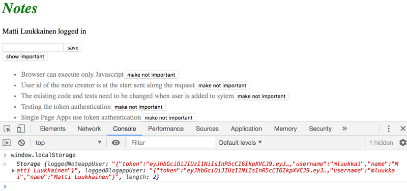
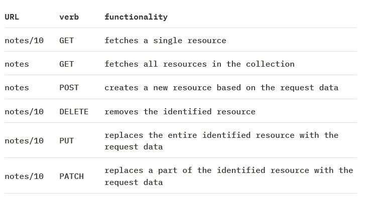
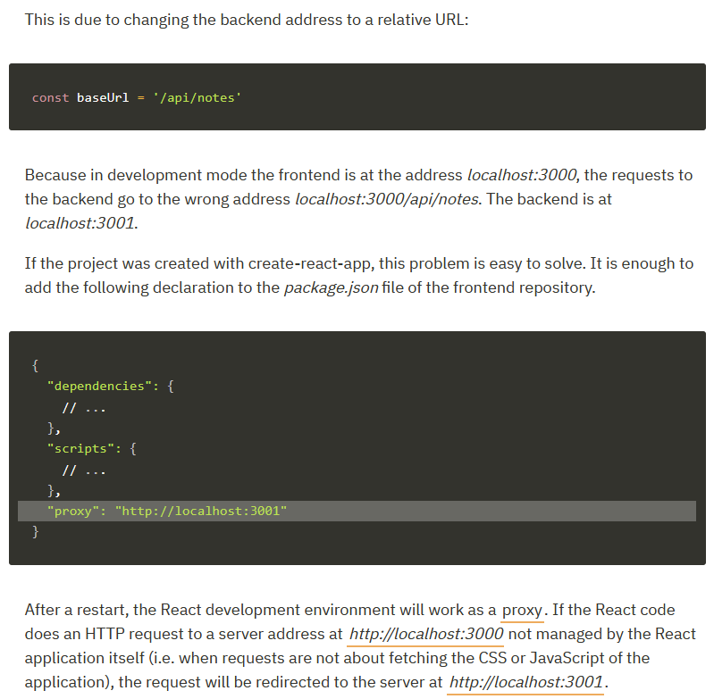
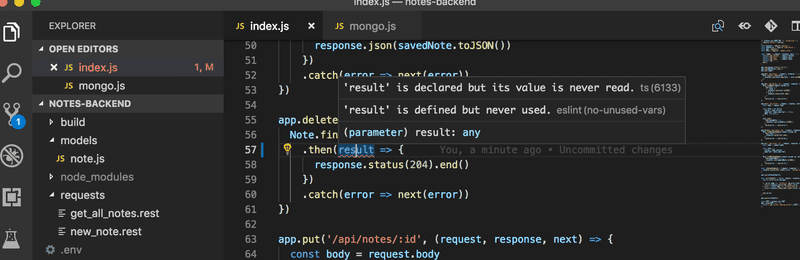
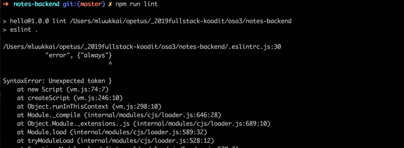
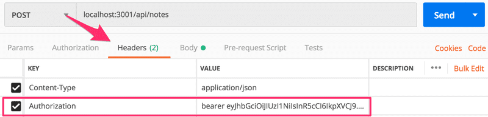

# fullstackopen 2021
****Deep Dive Into Modern Web Development**

# The course of full stack open 2021

* part0 Fundamentals of Web apps
* part1 Introduction to React
* part2 Communicating with server
* part3 Programming a server with NodeJS and Express
* part4 Testing Express servers, user administration
* part5 Testing React apps
* part6 State management with Redux
* part7 React router, custom hooks, styling app with CSS and webpack
* part8 GraphQL
* part9 TypeScript
* part10 React Native
* part11 CI/CD

# Create React App

```
npx create-react-app myapp {. | myApp}
cd my-app
npm start
```
# Support example apps

* [Application Courses React App ](https://github.com/FullStack-HY/part2-notes/)

# You can thiew 

*** https://flaviocopes.com/ ***
# Useful 

* [Thymeleaf used along with Java Spring](https://www.thymeleaf.org/)
* [ECMAScript6-ES6](http://es6-features.org/#BlockScopedVariables)
* [JS Arrow function expressions](https://developer.mozilla.org/en-US/docs/Web/JavaScript/Reference/Functions/Arrow_functions)
* [create-react-app](https://github.com/facebook/create-react-app)
* [the React-library](https://reactjs.org/docs/getting-started.html)
* [React-component](https://reactjs.org/docs/components-and-props.html)
* [Babel](https://babeljs.io/)
* [XML](https://developer.mozilla.org/en-US/docs/Web/XML/XML_introduction)
* [Props It is possible to pass data to components using so called props.](https://reactjs.org/docs/components-and-props.html)
* [JSbin](https://jsbin.com/?js,console)
* [ECMAScript compatibility table](http://kangax.github.io/compat-table/es2016plus/)
* [Install JSON Server](https://github.com/typicode/json-server#getting-started)
* [Using Concurrently with json-server and your React App](https://medium.com/@joelazarz/using-concurrently-with-json-server-and-your-react-app-3d07487acc50)
* [React Filter](https://sebhastian.com/react-filter/)
* [Tips Reac Patterns - Get the latest React patterns, tips, and tricks right to your inbox.](https://reactpatterns.com/)


* [Inline styles](https://react-cn.github.io/react/tips/inline-styles.html)
*** inline style ***

The visibility of the component is defined by giving the component an inline style rule, where the value of the display property is none if we do not want the component to be displayed:

```
const hideWhenVisible = { display: loginVisible ? 'none' : '' }
const showWhenVisible = { display: loginVisible ? '' : 'none' }

<div style={hideWhenVisible}>
  // button
</div>

<div style={showWhenVisible}>
  // button
</div>
```

* [props.children](https://reactjs.org/docs/glossary.html#propschildren)

```TS
import React, { useState } from 'react'

const Togglable = (props) => {
  const [visible, setVisible] = useState(false)

  const hideWhenVisible = { display: visible ? 'none' : '' }
  const showWhenVisible = { display: visible ? '' : 'none' }

  const toggleVisibility = () => {
    setVisible(!visible)
  }

  return (
    <div>
      <div style={hideWhenVisible}>
        <button onClick={toggleVisibility}>{props.buttonLabel}</button>
      </div>
      <div style={showWhenVisible}>
        {props.children}
        <button onClick={toggleVisibility}>cancel</button>
      </div>
    </div>
  )
}

export default Togglable
```

  ## React trick
* [React trick](https://reactjs.org/docs/conditional-rendering.html#inline-if-with-logical--operator)

```TS
{
  user === null && loginForm()
}

return (
  <div>
    <h1>Notes</h1>

    <Notification message={errorMessage}/>

    {user === null ?
      loginForm() :
      noteForm()
    }

    <h2>Notes</h2>

    // ...

  </div>
)

```
## prop-types

***Runtime type checking for React props and similar objects.***

You can use prop-types to document the intended types of properties passed to components. React (and potentially other libraries—see the checkPropTypes() reference below) will check props passed to your components against those definitions, and warn in development if they don’t match.

* [prop-types](https://github.com/facebook/prop-types)

* [Conditional (ternary) operator](https://developer.mozilla.org/en-US/docs/Web/JavaScript/Reference/Operators/Conditional_Operator)

* [Truthy, In JavaScript, a truthy value is a value that is considered true](https://developer.mozilla.org/en-US/docs/Glossary/Truthy)

* [References to components with ref](https://reactjs.org/docs/refs-and-the-dom.html)
* [useRef](https://reactjs.org/docs/hooks-reference.html#useref)
* [React.forwardRef](https://reactjs.org/docs/react-api.html#reactforwardref)
* [Refs and the DOM](https://reactjs.org/docs/refs-and-the-dom.html)
## useImperativeHandle

***To recap, the useImperativeHandle function is a React hook, that is used for defining functions in a component which can be invoked from outside of the component.***
* [useImperativeHandle](https://reactjs.org/docs/hooks-reference.html#useimperativehandle)

## App React wirh API Rest Server Json 

```
npm install -g json-server
```
* Run JSON Server on your app
```
npx json-server --port 3001 --watch db.json
```
* Install json-server as a development dependency (only used during development) by executing the command:
```
npm install json-server --save-dev
```
and making a small addition to the scripts part of the package.json file:

```
"server": "json-server -p3001 --watch db.json"
```
After install j-son server and backend as dependencies in our project.

```
 npm i -D json-server backend
```
In package.json
```
"dev": "concurrently \"npm run start\" \"npm run json-server\""
```


## Saving the token to the browser's local storage


* [local storage](https://developer.mozilla.org/en-US/docs/Web/API/Storage)

Our application has a flaw: when the page is rerendered, information of the user's login disappears. This also slows down development. For example when we test creating new notes, we have to login again every single time.

This problem is easily solved by saving the login details to local storage. [Local Storage](https://developer.mozilla.org/en-US/docs/Web/API/Storage) is a [key-value](https://en.wikipedia.org/wiki/Key%E2%80%93value_database) database in the browser.

It is very easy to use. A value corresponding to a certain key is saved to the database with method [setItem](https://developer.mozilla.org/en-US/docs/Web/API/Storage/setItem).

For example: 

```
window.localStorage.setItem('name', 'juha tauriainen')
```

saves the string given as the second parameter as the value of key name.

The value of a key can be found with method getItem:

and [removeItem](https://developer.mozilla.org/en-US/docs/Web/API/Storage/removeItem) removes a key. 

Values in the local storage are persisted even when the page is rerendered. The storage is origin-specific so each web application has its own storage.

Let's extend our application so that it saves the details of a logged-in user to the local storage.

Values saved to the storage are DOMstrings, so we cannot save a JavaScript object as is. The object has to be parsed to JSON first, with the method JSON.stringify. Correspondingly, when a JSON object is read from the local storage, it has to be parsed back to JavaScript with JSON.parse.

Changes to the login method are as follows: 

```TS
  const handleLogin = async (event) => {
    event.preventDefault()
    try {
      const user = await loginService.login({
        username, password,
      })

      window.localStorage.setItem(        'loggedNoteappUser', JSON.stringify(user)      )       noteService.setToken(user.token)
      setUser(user)
      setUsername('')
      setPassword('')
    } catch (exception) {
      // ...
    }
  }
```

The details of a logged-in user are now saved to the local storage, and they can be viewed on the console (by typing window.localStorage to the console): 
.


You can also inspect the local storage using the developer tools. On Chrome, go to the Application tab and select Local Storage (more details [here](https://developer.chrome.com/docs/devtools/storage/localstorage/)). On Firefox go to the Storage tab and select Local Storage (details [here](https://developer.mozilla.org/en-US/docs/Tools/Storage_Inspector)).

We still have to modify our application so that when we enter the page, the application checks if user details of a logged-in user can already be found on the local storage. If they can, the details are saved to the state of the application and to noteService.

The right way to do this is with an [effect hook](https://reactjs.org/docs/hooks-effect.html): a mechanism we first encountered in [part 2](https://fullstackopen.com/en/part2/getting_data_from_server#effect-hooks), and used to fetch notes from the server.


We can have multiple effect hooks, so let's create a second one to handle the first loading of the page:

```TS
const App = () => {
  const [notes, setNotes] = useState([]) 
  const [newNote, setNewNote] = useState('')
  const [showAll, setShowAll] = useState(true)
  const [errorMessage, setErrorMessage] = useState(null)
  const [username, setUsername] = useState('') 
  const [password, setPassword] = useState('') 
  const [user, setUser] = useState(null) 

  useEffect(() => {
    noteService
      .getAll().then(initialNotes => {
        setNotes(initialNotes)
      })
  }, [])

  useEffect(() => {    const loggedUserJSON = window.localStorage.getItem('loggedNoteappUser')    
  if (loggedUserJSON) {      
    const user = JSON.parse(loggedUserJSON)     
    setUser(user)      
    noteService.setToken(user.token)   
    }  
  }, [])
  // ...
}
```

The empty array as the parameter of the effect ensures that the effect is executed only when the component is rendered [for the first time](https://reactjs.org/docs/hooks-reference.html#conditionally-firing-an-effect).

Now a user stays logged-in in the application forever. We should probably add a logout functionality which removes the login details from the local storage. We will however leave it for an exercise.

It's possible to log out a user using the console, and that is enough for now. You can log out with the command:

```JS
window.localStorage.removeItem('loggedNoteappUser')
```

or with the command which empties localstorage completely: 

```JS
window.localStorage.clear()
```

Current application code can be found on [Github](https://github.com/fullstack-hy/part2-notes/tree/part5-3), branch part5-3.


***A note on using local storage***

At the end of the last part we mentioned that the challenge of the token based authentication is how to cope with the situation when the API access of the token holder to the API needs to be revoked.

There are two solutions to the problem. The first one is to limit the validity period of a token. This forces the user to relogin to the app once the token has expired. The other approach is to save the validity information of each token to the backend database. This solution is often called a server side session.

No matter how the validity of tokens is checked and ensured, saving a token in the local storage might contain a security risk if the application has a security vulnerability that allows [Cross Site Scripting (XSS)](https://owasp.org/www-community/attacks/xss/) attacks. A XSS attack is possible if the application would allow a user to inject arbitrary JavaScript code (e.g. using a form) that the app would then execute. When using React in a sensible manner it should not be possible since [React sanitizes](https://reactjs.org/docs/introducing-jsx.html#jsx-prevents-injection-attacks) all text that it renders, meaning that it is not executing the rendered content as JavaScript.

If one wants to play safe, the best option is to not store a token to the local storage. This might be an option in situations where leaking a token might have tragic consequences.

It has been suggested that the identity of a signed in user should be saved as [httpOnly cookies](https://developer.mozilla.org/en-US/docs/Web/HTTP/Cookies#restrict_access_to_cookies), so that JavaScript code could not have any access to the token. The drawback of this solution is that it would make implementing SPA-applications a bit more complex. One would need at least to implement a separate page for logging in.

However it is good to notice that even the use of a httpOnly cookies does not guarantee anything. It has even been suggested that httpOnly cookies are [not any safer than](https://academind.com/tutorials/localstorage-vs-cookies-xss) the use of local storage.

So no matter the used solution the most important thing is to [minimize the risk](https://cheatsheetseries.owasp.org/cheatsheets/DOM_based_XSS_Prevention_Cheat_Sheet.html) of XSS attacks altogether.


* [What the heck is the event loop anyway?](https://www.youtube.com/watch?v=8aGhZQkoFbQ)

* [Promise based HTTP client for the browser and node.js](https://www.npmjs.com/package/axios)
Execute command at the root of the project:
```
npm install axios
```
Axios is now included among the other dependencies: in package.json in section dependencies

## Programer's materials

* [single responsibility principle](https://en.wikipedia.org/wiki/Single-responsibility_principle)
* [transitive dependencies ](https://lexi-lambda.github.io/blog/2016/08/24/understanding-the-npm-dependency-model/)
* [semantic versioning](https://docs.npmjs.com/about-semantic-versioning)

# XSS

*[xss](https://owasp.org/www-community/attacks/xss/)


# Question everything

Debugging Full Stack applications may seem tricky at first. Soon our application will also have a database in addition to the frontend and backend, and there will be many potential areas for bugs in the application.

When the application "does not work", we have to first figure out where the problem actually occurs. It's very common for the problem to exist in a place where you didn't expect it to, and it can take minutes, hours, or even days before you find the source of the problem.

The key is to be systemic. Since the problem can exist anywhere, you must question everything, and eliminate all possibilities one by one. Logging to the console, Postman, debuggers, and experience will help.

When bugs occur, the worst of all possible strategies is to continue writing code. It will guarantee that your code will soon have even more bugs, and debugging them will be even more difficult. The stop and fix principle from Toyota Production Systems is very effective in this situation as well.


## Jidoka - Build a culture of stopping to fix ….

***Construire une culture d'arrêt pour résoudre le problème, pour obtenir la bonne qualité du premier coup***


La méthode Jidoka consiste à arrêter le travail dès qu'un problème survient pour éviter de produire des éléments défectueux. Il s'agit ainsi de « construire la qualité dans le produit, en détectant les anomalies dans le processus

## JavaScript materials

* In Js Toutes les valeurs sont vraies sauf si elles sont définies comme fausses (c'est-à-dire, à l'exception de faux, 0, -0, 0n, "", null, undefined et NaN). 

```TS
//Truthy
if (true)
if ({})
if ([])
if (42)
if ("0")
if ("false")
if (new Date())
if (-42)
if (12n)
if (3.14)
if (-3.14)
if (Infinity)
if (-Infinity)
```

* [Mozilla's JavaScript Guide](http://kangax.github.io/compat-table/es2016plus)
* [A re-introduction to JavaScript (JS tutorial) ](http://kangax.github.io/compat-table/es2016plus)
* [You-Dont-Know-JS](https://github.com/getify/You-Dont-Know-JS)
* [javascript.info](https://github.com/getify/You-Dont-Know-JS)
* [Destructuring](https://medium.com/@lcriswell/destructuring-props-in-react-b1c295005ce0)
* [JS Refactor plugin for VS Code that automatically changes short form arrow functions into their longer form, and vice versa.](https://marketplace.visualstudio.com/items?itemName=cmstead.jsrefactor)
* https://developer.mozilla.org/en-US/docs/Web/JavaScript/Reference/Template_literals
* [Template literals](https://developer.mozilla.org/en-US/docs/Web/JavaScript/Reference/Template_literals)
* [Spread syntax](https://developer.mozilla.org/en-US/docs/Web/JavaScript/Reference/Operators/Spread_syntax)
* [npm script](https://docs.npmjs.com/cli/v7/using-npm/scripts)
# JavaScript Arrays

* [Higher-order functions](https://www.youtube.com/watch?v=BMUiFMZr7vk&list=PL0zVEGEvSaeEd9hlmCXrk5yUyqUag-n84)
* [Map](https://www.youtube.com/watch?v=bCqtb-Z5YGQ&list=PL0zVEGEvSaeEd9hlmCXrk5yUyqUag-n84&index=3)
* [Reduce basics](https://www.youtube.com/watch?v=Wl98eZpkp-c&t=31s)
* [Index as a key is an anti-pattern](https://robinpokorny.medium.com/index-as-a-key-is-an-anti-pattern-e0349aece318)
* [Simplify your JavaScript – Use .map(), .reduce(), and .filter()](https://medium.com/poka-techblog/simplify-your-javascript-use-map-reduce-and-filter-bd02c593cc2d)


# Web
* [Representational State Transfer (REST)](https://www.ics.uci.edu/~fielding/pubs/dissertation/rest_arch_style.htm)
* [Status Code Definitions](https://www.w3.org/Protocols/rfc2616/rfc2616-sec10.html#sec10.2.5)
* [Same origin policy and CORS](https://en.wikipedia.org/wiki/Cross-origin_resource_sharing)
* [Same-origin policy](https://developer.mozilla.org/en-US/docs/Web/Security/Same-origin_policy)
* [CORS](https://developer.mozilla.org/en-US/docs/Web/HTTP/CORS)


# Rest

Let's expand our application so that it provides the same RESTful HTTP API as json-server.

Representational State Transfer, aka REST, was introduced in 2000 in Roy Fielding's dissertation. REST is an architectural style meant for building scalable web applications.

* [json-server](https://github.com/typicode/json-server#routes)
* [Representational State Transfer (REST)](https://www.ics.uci.edu/~fielding/pubs/dissertation/rest_arch_style.htm)



# Express

* [HTTP Status Codes](https://httpstatuses.com/)


***Fast, unopinionated, minimalist web framework for node.***

Express est une infrastructure d'applications Web Node.js minimaliste et flexible qui fournit un ensemble de fonctionnalités robuste pour les applications Web et mobiles. 
route-parameters
```
npm install express
```
On node app
```
const express = require('express')
const app = express()
app.use(express.json());
```
* [A signale Part3 - Receiving data ](https://fullstackopen.com/en/part3/node_js_and_express#receiving-data)

## Error Handling on Express

***Error Handling refers to how Express catches and processes errors that occur both synchronously and asynchronously. Express comes with a default error handler so you don’t need to write your own to get started***

* [Error Handling middleware](https://expressjs.com/en/guide/error-handling.html)

## Middleware


### Middleware Use

*** Les fonctions de middleware sont des fonctions qui peuvent accéder à l’objet Request (req), l’objet response (res) et à la fonction middleware suivant dans le cycle demande-réponse de l’application. La fonction middleware suivant est couramment désignée par une variable nommée next. ***

* [using-middleware](https://expressjs.com/fr/guide/using-middleware.html)

Note that it is possible to register a middleware only for a specific set of routes. So instead of using userExtractor with all the routes

```TS
// use the middleware in all routes
app.use(userExtractor)
app.use('/api/blogs', blogsRouter)  
app.use('/api/users', usersRouter)
app.use('/api/login', loginRouter)
```

we could register it to be only executed with path /api/blogs routes: 

```TS
// use the middleware only in /api/blogs routes
app.use('/api/blogs', userExtractor, blogsRouter)
```

As can be seen, this happens by chaining multiple middlewares as the parameter of function use. It would also be possible to register a middleware only for a specific operation:

```
router.post('/', userExtractor, async (request, response) => {
  // ...
}
```

### Middleware function

***The app now uses the requestTime middleware function. Also, the callback function of the root path route uses the property that the middleware function adds to req (the request object)***

```TS
var express = require('express')
var app = express()

var requestTime = function (req, res, next) {
  req.requestTime = Date.now()
  next()
}

app.use(requestTime)

app.get('/', function (req, res) {
  var responseText = 'Hello World!<br>'
  responseText += '<small>Requested at: ' + req.requestTime + '</small>'
  res.send(responseText)
})

app.listen(3000)
```

# ExpressJS Async Errors

```
https://github.com/davidbanham/express-async-errors
```
# Morgan

npm install express-async-errors --save

***HTTP request logger middleware for node.js***
* [morgan](morganhttps://github.com/expressjs/morgan)

## Problems on React 

* [Use Hooks with Array and Object](https://dev.to/brettblox/react-hooks-usestate-43en)
* [never mutate state directly in React!](https://reactjs.org/docs/state-and-lifecycle.html#using-state-correctly)
* [lists-and-keys](https://reactjs.org/docs/lists-and-keys.html#keys)

# Cors
* [cors](https://github.com/expressjs/cors)
***CORS is a node.js package for providing a Connect/Express middleware that can be used to enable CORS with various options.***

# Heroku
* [Getting Started on Heroku with Node.js](https://devcenter.heroku.com/articles/getting-started-with-nodejs)
***Heroku is a platform as a service (PaaS) that enables developers to build, run, and operate applications entirely in the cloud.***
```
sudo npm install -g heroku
heroku --version
```
* Add a file called Procfile to the project's root to tell Heroku how to start the application.
```
web: npm start
```

## Step 1 Deploying with Git
* [Deploying with Git](https://devcenter.heroku.com/articles/git#creating-a-heroku-remote)

***Heroku manages app deployments with Git, the popular version control system. You definitely don’t need to be a Git expert to deploy code to Heroku, but it’s helpful to learn the basics.***
```
cd myapp

git init
Initialized empty Git repository in .git/

git add .

git commit -m "My first commit"
Created initial commit 5df2d09: My first commit
 44 files changed, 8393 insertions(+), 0 deletions(-)
 create mode 100644 README
 create mode 100644 Procfile
 create mode 100644 app/controllers/source_file
...
```

```
heroku create
Creating app... done, ⬢ thawing-inlet-61413
https://thawing-inlet-61413.herokuapp.com/ | https://git.heroku.com/thawing-inlet-61413.git
```
 tell you the difference between your branch and the remote one.
```
git remote -v
heroku  https://git.heroku.com/thawing-inlet-61413.git (fetch)
heroku  https://git.heroku.com/thawing-inlet-61413.git (push)
```

```
git remmote add heroku https://git.heroku.com/infinite-sierra-55116.git
git branch -u heroku/master
```

# Working with git remotes on Heroku

Generally, you will add a git remote for your Heroku app during the Heroku app creation process, i.e. `heroku create`. However, if you are working on an existing app and want to add git remotes to enable manual deploys, the following commands may be useful.

## Adding a new remote

### Add a remote for your Staging app and deploy
Note that on Heroku, you must always use `master` as the destination branch on the remote. If you want to deploy a different branch, you can use the syntax `local_branch:destination_branch` seen below (in this example, we push the local `staging` branch to the `master` branch on heroku.
```
$ git remote add staging https://git.heroku.com/staging-app.git
$ git push staging staging:master
```
In some cases, your local branch may be missing some commits that were already deployed to Heroku, resulting in an error. If you are **very sure** you want to proceed, add the `--force` (`-f`) flag.
```
$ git push staging staging:master -f
```

### Add a remote for your Production app and deploy
By convention, the remote name "heroku" is typically used for the production application.
```
$ git remote add heroku https://git.heroku.com/app.git
$ git push heroku master
```

### Add a remote via Heroku CLI
As [@voke](https://gist.github.com/randallreedjr/aa89e069371d07371882eea2df15fb4d#gistcomment-3079752) points out, you can alternatively use a [Heroku CLI command](https://devcenter.heroku.com/articles/git#creating-a-heroku-remote) to add your remote. However, it looks like this will always use the default remote name `heroku` for the remote. If you would like to use a different name for your remote, see the "Rename a remote" section below.
```
$ heroku git:remote -a staging-app
```

**Edit:** Thanks to [@nruth](https://gist.github.com/randallreedjr/aa89e069371d07371882eea2df15fb4d#gistcomment-3141611) for pointing out you can supply a remote name to this command with the `-r` flag.
```
$ heroku git:remote -a staging-app -r staging
```

### Add a remote using the SSH protocol
As [@Saworieza](https://gist.github.com/randallreedjr/aa89e069371d07371882eea2df15fb4d#gistcomment-2784952) points out, all of the examples above use the https protocol for connecting to the remotes, but it is also possible to connect via ssh.
```
$ git remote add staging git@heroku.com:staging-app.git
$ git remote add heroku git@heroku.com:app.git
```

## Other useful commands

### List your git remotes

The `-v` is the flag for "verbose" and includes the remote URL in addition to the remote name.

```
$ git remote -v
```

### Rename a remote
```
$ git remote rename heroku staging
```

### Change a remote URL or protocol
If you have already created https remotes and want to switch them to use ssh, the following command can be used. This command can also be used to change the target URL without changing the protocol

```
$ git remote set-url staging git@heroku.com:staging-app.git
$ git remote set-url heroku https://git.heroku.com/production-app.git
```

# Serving static files in Express
*[Static](http://expressjs.com/en/starter/static-files.html)
***To serve static files such as images, CSS files, and JavaScript files, use the express.static built-in middleware function in Express.***
## Debugging React applications

* On application you can use instruction ```debugger``` 

* [React Developer Tools Firefox](https://addons.mozilla.org/fr/firefox/addon/react-devtools/)
* [React Developer Tools Chrome](https://chrome.google.com/webstore/detail/react-developer-tools/fmkadmapgofadopljbjfkapdkoienihi)
* [The Beginner's Guide to React](https://egghead.io/courses/the-beginner-s-guide-to-react)

# How Debugging React applications on console

## Use
```
console.log('props value is', props)
```
## Never use
```
console.log('props value is' + props)
```
The most important snippet is the one for the console.log() command, for example clog. This can be created like so: 
```
{
  "console.log": {
    "prefix": "clog",
    "body": [
      "console.log('$1')",
    ],
    "description": "Log output to console"
  }
}
```

# Proxy 

Changes on the frontend have caused it to no longer work in development mode (when started with command ***npm start***), as the connection to the backend does not work. 



# Mongoose

* [Mongoose](https://www.npmjs.com/package/mongoose)

***Mongoose is a MongoDB object modeling tool designed to work in an asynchronous environment. Mongoose supports both promises and callbacks.***

```
npm install mongoose
```
# MongoDB

* [MongoDB Atlas](https://www.mongodb.com/cloud/atlas)

We will use [MongoDB](https://www.mongodb.com/) which is a so-called [document database](https://en.wikipedia.org/wiki/Document-oriented_database).

Document databases differ from relational databases in how they organize data as well as the query languages they support. Document databases are usually categorized under the NoSQL umbrella term.

Read now the chapters on [collections](https://docs.mongodb.com/manual/core/databases-and-collections/) and [documents](https://docs.mongodb.com/manual/core/document/) from the MongoDB manual to get a basic idea on how a document database stores data.

* Connection
NB: Please note the password is the password created for the database user, not your MongoDB Atlas password. Also, if you created password with special characters, then you'll need to [URL encode that password](https://docs.atlas.mongodb.com/troubleshoot-connection/#special-characters-in-connection-string-password).

* Schema

***After establishing the connection to the database, we define the schema for a note and the matching model:***

``` 

const noteSchema = new mongoose.Schema({
  content: String,
  date: Date,
  important: Boolean,
})

const Note = mongoose.model('Note', noteSchema)
```

* Creating and saving objects

***Next, the application creates a new note object with the help of the Note model:***

```
const note = new Note({
  content: 'HTML is Easy',
  date: new Date(),
  important: false,
})
```
## Validation Mongoose

***One smarter way of validating the format of the data before it is stored in the database, is to use the validation functionality available in Mongoose.We can define specific validation rules for each field in the schema:***

* [Validation Mongoose](https://mongoosejs.com/docs/validation.html)

```
npm install --save mongoose-unique-validator --legacy-peer-deps
```

```
const schema = new Schema({
  name: {
    type: String,
    required: true
  }
});
const Cat = db.model('Cat', schema);

// This cat has no name :(
const cat = new Cat();
cat.save(function(error) {
  assert.equal(error.errors['name'].message,
    'Path `name` is required.');

  error = cat.validateSync();
  assert.equal(error.errors['name'].message,
    'Path `name` is required.');
});

```
Other example 
```
var mongoose = require('mongoose');
var uniqueValidator = require('mongoose-unique-validator');
 
// Define your schema as normal.
var userSchema = mongoose.Schema({
    username: { type: String, required: true, unique: true },
    email: { type: String, index: true, unique: true, required: true },
    password: { type: String, required: true }
}
);
```

NB: On update operations, mongoose validators are off by default. Read the documentation to determine how to enable them.
```
function setRunValidators() {
    this.setOptions({ runValidators: true });
  }

mongoose.plugin(schema => {
schema.pre('update', setRunValidators);
});
// Apply the uniqueValidator plugin to userSchema.
userSchema.plugin(uniqueValidator);
```


// Pre hook for `findOneAndUpdate`
personSchema.pre('findOneAndUpdate', function(next) {
    this.options.runValidators = true;
    next();
  });

#  Mongoose Populate

*** The Mongoose join is done with the populate method. *** 

* [Populate](https://mongoosejs.com/docs/c.html)
* [The selection of fields is done with the Mongo syntax:](https://docs.mongodb.com/manual/tutorial/project-fields-from-query-results/#return-the-specified-fields-and-the-id-field-only)

https://docs.mongodb.com/manual/tutorial/project-fields-from-query-results/#return-the-specified-fields-and-the-id-field-only

```
usersRouter.get('/', async (request, response) => {
  const users = await User
    .find({}).populate('blogs',{title: 1,author: 1})

  response.json(users)
});
```

 # Jsonwebtoken Token based authentication

 * [Token based authentication ](https://www.digitalocean.com/community/tutorials/the-ins-and-outs-of-token-based-authentication#toc-how-token-based-works)

* [JSON web tokens](https://jwt.io/)

*** The principles of token based authentication are depicted in the following sequence diagram:  ***


## For test with supertest and Token based authentication 

*** Set Authorization header to post request ***

[This is most likely useful when doing the fix.](https://github.com/visionmedia/supertest/issues/398)
# Lint

Before we move onto the next part, we will take a look at an important tool called lint. Wikipedia says the following about lint:

    Generically, lint or a linter is any tool that detects and flags errors in programming languages, including stylistic errors. The term lint-like behavior is sometimes applied to the process of flagging suspicious language usage. Lint-like tools generally perform static analysis of source code.

In compiled statically typed languages like Java, IDEs like NetBeans can point out errors in the code, even ones that are more than just compile errors. Additional tools for performing static analysis like checkstyle, can be used for expanding the capabilities of the IDE to also point out problems related to style, like indentation.

In the JavaScript universe, the current leading tool for static analysis aka. "linting" is ESlint.

Let's install ESlint as a development dependency to the backend project with the command:

```
npm install eslint --save-dev
```
After this we can initialize a default ESlint configuration with the command:
```
node_modules/.bin/eslint --init
```
The configuration will be saved in the .eslintrc.js file:
```
module.exports = {
    "env": {
        "browser": true,
        "es2021": true
    },
    "extends": [
        "eslint:recommended",
        "plugin:react/recommended"
    ],
    "parserOptions": {
        "ecmaFeatures": {
            "jsx": true
        },
        "ecmaVersion": 12,
        "sourceType": "module"
    },
    "plugins": [
        "react"
    ],
    "rules": {
    }
};
```
Let's immediately change the rule concerning indentation, so that the indentation level is two spaces.
```
"indent": [
    "error",
    2
],
```
Inspecting and validating a file like index.js can be done with the following command:
```
node_modules/.bin/eslint index.js
```
It is recommended to create a separate npm script for linting:
```
{
  // ...
  "scripts": {
    "start": "node index.js",
    "dev": "nodemon index.js",
    // ...
    "lint": "eslint ."
  },
  // ...
}
```
Now the npm run lint command will check every file in the project.


Also the files in the build directory get checked when the command is run. We do not want this to happen, and we can accomplish this by creating an [.eslintignore](https://eslint.org/docs/user-guide/configuring/#ignoring-files-and-directories) file in the project's root with the following contents:

Let's not fix these issues just yet.

A better alternative to executing the linter from the command line is to configure a eslint-plugin to the editor, that runs the linter continuously. By using the plugin you will see errors in your code immediately. You can find more information about the Visual Studio ESLint plugin [here](https://marketplace.visualstudio.com/items?itemName=dbaeumer.vscode-eslint).




This makes errors easy to spot and fix right away.

ESlint has a vast array of rules that are easy to take into use by editing the .eslintrc.js file.

Let's add the eqeqeq rule that warns us, if equality is checked with anything but the triple equals operator. The rule is added under the rules field in the configuration file.

```
{
  // ...
  'rules': {
    // ...
   'eqeqeq': 'error',
  },
}
```

While we're at it, let's make a few other changes to the rules.

Let's prevent unnecessary [trailing spaces](https://eslint.org/docs/rules/no-trailing-spaces) at the ends of lines, let's require that [there is always a space before and after curly braces](https://eslint.org/docs/rules/object-curly-spacing), and let's also demand a consistent use of whitespaces in the function parameters of arrow functions.


```
//On .eslintrc.js
{
  // ...
  'rules': {
    // ...
    'eqeqeq': 'error',
    'no-trailing-spaces': 'error',
    'object-curly-spacing': [
        'error', 'always'
    ],
    'arrow-spacing': [
        'error', { 'before': true, 'after': true }
    ]
  },
}
```

Our default configuration takes a bunch of predetermined rules into use from eslint:recommended:

```
'extends': 'eslint:recommended',
```
This includes a rule that warns about console.log commands. [Disabling](https://eslint.org/docs/user-guide/configuring/#configuring-rules) a rule can be accomplished by defining its "value" as 0 in the configuration file. Let's do this for the no-console rule in the meantime.

```
{
  // ...
  'rules': {
    // ...
    'eqeqeq': 'error',
    'no-trailing-spaces': 'error',
    'object-curly-spacing': [
        'error', 'always'
    ],
    'arrow-spacing': [
        'error', { 'before': true, 'after': true }
    ],
    'no-console': 0  },
}
```
NB when you make changes to the .eslintrc.js file, it is recommended to run the linter from the command line. This will verify that the configuration file is correctly formatted:




If there is something wrong in your configuration file, the lint plugin can behave quite erratically.

Many companies define coding standards that are enforced throughout the organization through the ESlint configuration file. It is not recommended to keep reinventing the wheel over and over again, and it can be a good idea to adopt a ready-made configuration from someone else's project into yours. Recently many projects have adopted the Airbnb [Javascript style guide](https://github.com/airbnb/javascript) by taking Airbnb's [ESlint](https://github.com/airbnb/javascript/tree/master/packages/eslint-config-airbnb) configuration into use.


# eslint-plugin-jest

* [eslint-plugin-jest](https://www.npmjs.com/package/eslint-plugin-jest)

 # Jest 
Jest est un framework de test JavaScript de qualité qui met l'accent sur la simplicité.

Il fonctionne avec les projets utilisant : Babel, TypeScript, Node, React, Angular, Vue et plus encore !
```
npm install --save-dev jest
```

Another way of running a single test (or describe block) is to specify the name of the test to be run with the -t flag:
```
npm test -- -t 'when list has only one blog, equals the likes of that'
```
```
npm test -- tests/blog_api.test.js 
```


# Test

https://github.com/testing-library/react-testing-library


# Testing React apps

* [Jest](https://jestjs.io/)
* [ react-testing-library](https://github.com/testing-library/react-testing-library)
* [testing-library](https://testing-library.com/docs/react-testing-library/api/#render)

## Rendering the component for tests


We will write our test in the src/components/Note.test.js file, which is in the same directory as the component itself.

The first test verifies that the component renders the contents of the note:

```TS
import React from 'react'
import '@testing-library/jest-dom/extend-expect'
import { render } from '@testing-library/react'
import Note from './Note'


test('renders content', () => {
  const note = {
    content: 'Component testing is done with react-testing-library',
    important: true
  }

  const component = render(
    <Note note={note} />
  )

  expect(component.container).toHaveTextContent(
    'Component testing is done with react-testing-library'
  )
})
```


After the initial configuration, the test renders the component with the render method provided by the react-testing-library:

```TS
const component = render(
  <Note note={note} />
)
```


Normally React components are rendered to the DOM. The render method we used renders the components in a format that is suitable for tests without rendering them to the DOM.

render returns an object that has several properties. One of the [properties](https://testing-library.com/docs/react-testing-library/api/#render-result) is called container, and it contains all of the HTML rendered by the component.

In the expectation, we verify that the component renders the correct text, which in this case is the content of the note:

```TS
expect(component.container).toHaveTextContent(
  'Component testing is done with react-testing-library'
)
```

Run test
If you want to run tests "normally", you can do so with the command:

```
CI=true npm test
```


the console may issue a warning if you have not installed Watchman. Watchman is an application developed by Facebook that watches for changes that are made to files. The program speeds up the execution of tests and at least starting from macOS Sierra, running tests in watch mode issues some warnings to the console, that can be removed by installing Watchman.

Instructions for installing Watchman on different operating systems can be found on the official Watchman website: https://facebook.github.io/watchman/


```
npm install --save-dev @testing-library/react @testing-library/jest-dom
```

## Test file location

In React there are (at least) [two different conventions](https://medium.com/@JeffLombardJr/organizing-tests-in-jest-17fc431ff850) for the test file's location. We created our test files according to the current standard by placing them in the same directory as the component being tested.

The other convention is to store the test files "normally" in their own separate directory. Whichever convention we choose, it is almost guaranteed to be wrong according to someone's opinion.

Personally, I do not like this way of storing tests and application code in the same directory. The reason we choose to follow this convention is that it is configured by default in applications created by create-react-app.

# Lodash 
A modern JavaScript utility library delivering modularity, performance & extras.

* [Why Lodash?](https://lodash.com/)


# cross-env
cross-env makes it so you can have a single command without worrying about setting or using the environment variable properly for the platform. Just set it like you would if it's running on a POSIX system, and cross-env will take care of setting it properly.


* [cross-env](https://www.npmjs.com/package/cross-env)
```
npm install --save-dev cross-env
```

# supertest

The motivation with this module is to provide a high-level abstraction for testing HTTP, while still allowing you to drop down to the lower-level API provided by superagent.

* [supertest](https://github.com/visionmedia/supertest)

```
npm install supertest --save-dev
```

# Install the package as a developpement dependency:

* supertest or express-async-errors

```
npm install supertest --save-dev
npm install --save-dev express-async-errors
```
# Testing Mongoose with Jest

*[Testing Mongoose with Jest](https://mongoosejs.com/docs/jest.html)

To change your ```testEnvironment``` to Node.js, add ```testEnvironment``` to your ```jest.config.js``` file:

```
module.exports = {
  testEnvironment: 'node'
};
```

```
npm test -- tests/note_api.test.js
npm test -- -t "a specific note is within the returned notes"
npm test -- -t 'notes'
```
## Promises chaining

# Useful libraries

# Useful for VScode

## Protip: Visual Studio Code snippets

 [Instructions for creating snippets can be found here.](https://code.visualstudio.com/docs/editor/userdefinedsnippets#_creating-your-own-snippets)

 [Useful, ready-made snippets can also be found as VS Code plugins, in the marketplace.](https://marketplace.visualstudio.com/items?itemName=xabikos.ReactSnippets)


# command-line parameters Node app

***You can get the command-line parameters from the [process.argv](https://nodejs.org/docs/latest-v8.x/api/process.html#process_process_argv) variable.***

# Problems on Code React 

## [Hoock with Array and Object](https://dev.to/brettblox/react-hooks-usestate-43en)
# Problems encountred

## Update npm

```
npm install -g npm
```

## React-scripts not found

You need for node_module

```
npm install react-scripts --save
```

## Problem can't find module

```
npm cache verify && rm -rf node_modules/ && npm i
```
or 
```
npm i --legacy-peer-deps
```
or
```
npm update --force
```


Node applicaiton:  We can update the dependencies of the project with the command:

```
npm update
```

Node applicaiton: Likewise, if we start working on the project on another computer, we can install all up-to-date dependencies of the project defined in package.json with the command:

```
npm install
```
## How to efficiently update your npm dependencies ?

Unfortunately, npm doesn't integrate natively any upgrade tool. So to do it, you need to install a new global dependency. And here is a good one: npm-check. You can use it by running the following: 

```
npm install -g npm-check
```
And then, in your repository :  npm-check -u (-u options activate the interactive update).
```
npm-check -u
```
# If install a application, but you have to install its dependencies first: 

```
npm install
```


* [How to efficiently update your npm dependencies ?](https://code-trotter.com/web/how-to-efficiently-update-your-npm-dependencies/)
## How to run multiple commands concurrently
[Concurrently](https://www.npmjs.com/package/concurrently)
***Run multiple commands concurrently. Like npm run watch-js & npm run watch-less but better.***

* The tool is written in Node.js, but you can use it to run any commands.
```
npm install -g concurrently
```
* or if you are using it from npm scripts:
```
npm install concurrently --save
```

## Active Debugging Node applications

### Chrome dev tools

Debugging is also possible with the Chrome developer console by starting your application with the command:

```
node --inspect index.js
```

You can access the debugger by clicking the green icon - the node logo - that appears in the Chrome developer console:


## Node App auto refresh with wsl2 

 * [nodemon](https://github.com/remy/nodemon) 

```
// Install nodemon globally with Node JS
npm install nodemon -g
```

```
npm install --save-dev nodemon
```

```
// On package.json in   "scripts" section add 
"dev": "nodemon -L index.js", -A signaler
```

# define the value of an environment variable when the application is started:

***Dotenv is a zero-dependency module that loads environment variables from a .env file into process.env. Storing configuration in the environment separate from code is based on The Twelve-Factor App methodology.***

* [the dotenv library](https://github.com/motdotla/dotenv#readme)

```
# with npm
npm install dotenv

# or with Yarn
yarn add dotenv
```
As early as possible in your application, require and configure dotenv.
```
require('dotenv').config()
```
Create a .env file in the root directory of your project. Add environment-specific variables on new lines in the form of NAME=VALUE. For example:
```
DB_HOST=localhost
DB_USER=root
DB_PASS=s1mpl3
```

process.env now has the keys and values you defined in your .env file.
```TS
const db = require('db')
db.connect({
  host: process.env.DB_HOST,
  username: process.env.DB_USER,
  password: process.env.DB_PASS
})
```


## Bcrypt

*** A library to help you hash passwords. ***

* [Bcrypt](https://github.com/kelektiv/node.bcrypt.js)

```
npm install bcrypt
```
### On Postman

*** Autorization Header  bearer eyJhbGciOiJIUzI1NiIsInR5cCI6IkpXVCJ ***




## storing passwords
* [How To Safely Store A Password](https://codahale.com/how-to-safely-store-a-password/)

## Jest has detected the following 1 open handle potentially keeping Jest from exiting:

### Solution n°1


## React auto refresh with wsl2 

### Solution n°1

We need to create a .env file at the root of the projet and add this two environnement variable.

```
CHOKIDAR_USEPOLLING=true
FAST_REFRESH=false
```

Add a environnement variable to Key API on .env
REACT_APP_API_KEY=MyKey

Using on React Component
```
const api_key = process.env.REACT_APP_API_KEY
```
### Solution n°2

Put the project inside the wsl directory that can be accessible with \\wsl$ variable inside Windows environement.

## Cypress launch with Windows WSL

Cypress doesn't launch and don't give us any errors.
We need to first download an XServer for windows, for example : https://github.com/ArcticaProject/vcxsrv and configure the shortcut target with -ac arguments.

```
C:/{pathtoexecutable}/xLaunch.exe -ac
```

When Xlaunch is launched, we need to tick the "Disable access control" box.

Next we need to export the DISPLAY environement variable with the wsl2 ip thanks to this script.

```
# set DISPLAY variable to the IP automatically assigned to WSL2
export DISPLAY=$(cat /etc/resolv.conf | grep nameserver | awk '{print $2; exit;}'):0.0
```

After that we start the dbus service with this command

```
# Automatically start D-Bus to allow communication with Cypress GUI app
sudo /etc/init.d/dbus start &> /dev/null
```
### Fix warnings in Browser Toolbox.
[hg.mozilla.org](https://hg.mozilla.org/integration/autoland/rev/b800ffcad8496b9124b7d246b15b4443d0be3830)